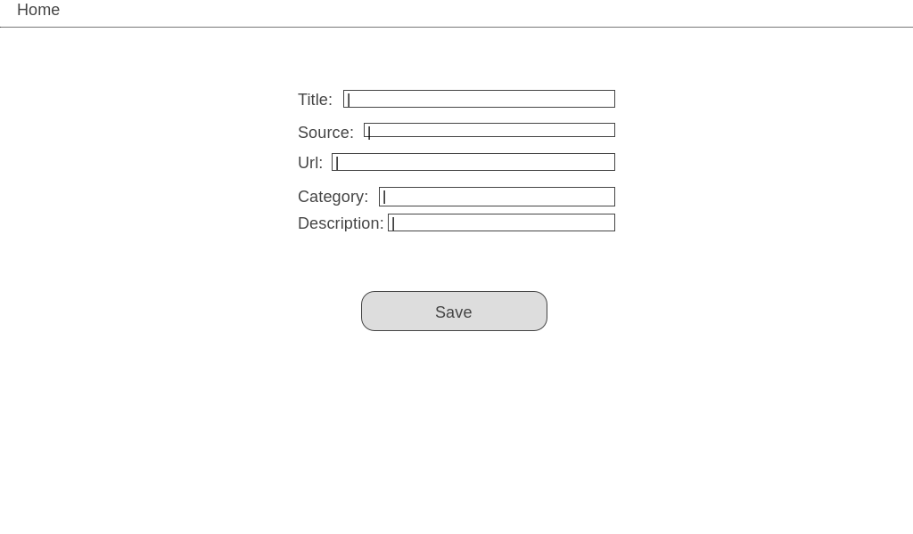

# Learn Coding


## Web Application Description 
This web application will gather the most valuable free programming video tutorials to get you started in the programming world .

---
## Prerequisites

npm  
```
$ npm install
```

Run server
```
$npm start
```

---
## User Stories
**Version 1**
* **Admin** user can create , show , update and delete videos to the application.
* The visitors can see all the videos.

**Version 2**
* User can sign up/in and add comments on the videos.

**Version 3**
* User can add any video to his list to watch later.

**Version 4**
* Filter the video by category.


## Wireframes
### Home page

### Show page

### Create / Update page



## Technologies
* React.js
* AJAX
* Bootstrap
* CSS


## Developer
Wijdan Kuddah